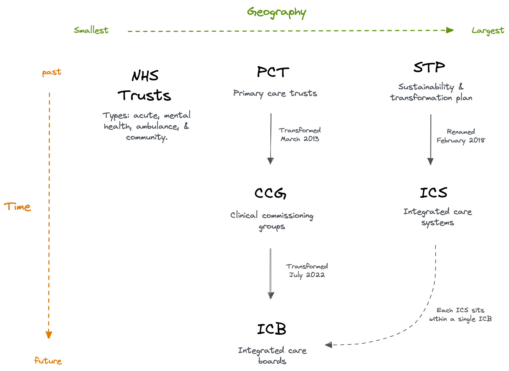
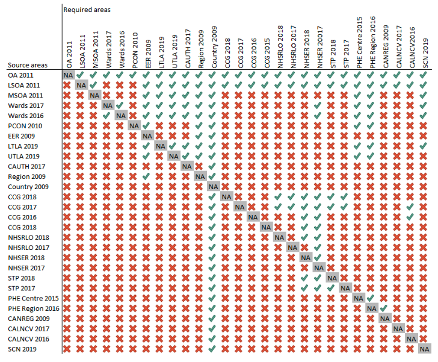

<!-- README.md is generated from README.Rmd. Please edit that file -->

# geographr </a>

<!-- badges: start -->

[](https://www.repostatus.org/#wip)
<!-- badges: end -->

## Overview

geographr is an R package for mapping UK geographies:

-   `boundaries_*` objects distribute boundaries (as [simple
    feature](https://r-spatial.github.io/sf/) objects)
-   `points_*` objects distribute point geometries (as [simple
    feature](https://r-spatial.github.io/sf/) objects)
-   `lookup_*` objects provide a set of lookup tables
-   `ruc_*` objects provide a set of rural-urban classifications
-   `calculate_*` functions solve common aggregation problems

## Installation

You can install the development version from
[GitHub](https://github.com/) with:

``` r
# install.packages("devtools")
devtools::install_github("britishredcrosssociety/geographr")
```

## Development

To add data sets to the package:

1.  Update `data-raw/query-urls.R`. Keep to alphabetical ordering. Make
    sure to build and export the tibble.
2.  Add a file to `data-raw/`. See other files for template.
3.  Document the data set in `R/data.R`. Keep to alphabetical ordering.
4.  Run `devtools::document()` to export documentation.
5.  Run `devtools::check()` to check for errors/warnings/notes.
6.  Update `LICENSE` by adding the license of the new data set if not
    already covered.


## UK geographies guide

### Census

#### OA

Census output areas (OA) are the smallest unit for which census data are
published - they were initially generated to support publication of 2001
Census outputs and contain at least 40 households and 100 persons, the
target size being 125 households. They were built up from postcode
blocks after the census data were available, with the intention of
standardising population sizes, geographical shape and social
homogeneity (in terms of dwelling types and housing tenure).

#### SOAs

Super Output Areas (SOAs) are a set of geographical areas developed
following the 2001 census, initially to facilitate the calculation of
the Indices of Deprivation 2004. The aim was to produce a set of areas
of consistent size, whose boundaries would not change (unlike electoral
wards). They are an aggregation of adjacent Output Areas with similar
social characteristics. Lower Layer Super Output Areas (LSOAs) typically
contain 4 to 6 OAs with a population of around 1500. Middle Layer Super
Output Areas (MSOAs) on average have a population of 7,200.

### Administrative

#### Electoral Wards

Electoral wards/divisions are the key building blocks of UK
administrative geography. They are the spatial units used to elect local
government councillors in metropolitan and non-metropolitan districts,
unitary authorities and the London boroughs in England; unitary
authorities in Wales; council areas in Scotland; and district council
areas in Northern Ireland.

#### Local Authority Districts

English local authority districts (LAD) (both metropolitan and
non-metropolitan), London boroughs and unitary authorities average
around 23 electoral wards/divisions each, Northern Irish district
council areas around 22, Scottish council areas around 11 and Welsh
unitary authorities about 40. Population counts can vary substantially,
even within a single LAD, but the national average is about 5,500. LA’s
are split by Lower Tier Local Authorities (LTLA’s) and Upper Tier Local
Authorities (UTLA’s). The difference between the two being LTLA’s use
district councils and UTLA’s use county councils. The ONS refers to
LTLA’s as LAD’s, and UTLA’s as Counties and Unitary Authorities.

### Health

#### Integrated Care Systems

Originally coined sustainability and transformation plan (STP), then
accountable care systems in 2017, they were renamed in February 2018 to
[Integrated Care
Systems](https://www.england.nhs.uk/integratedcare/integrated-care-systems/)
(ICS). They cover the whole of England and form part of the [NHS Long
Term Plan](https://en.wikipedia.org/wiki/NHS_Long_Term_Plan). In an ICS,
NHS organisations, in partnership with local councils and others, take
collective responsibility for managing resources, delivering NHS care,
and improving the health of the population they serve. ICS are supposed
to be bring together NHS trusts, Clinical Commissioning Groups and local
authorities.

#### Clnical Comission Groups

Replacement for PCT’s. They work with patients and healthcare
professionals and in partnership with local communities and local
authorities. The aim of this is to give GPs and other clinicians the
power to influence commissioning decisions for their patients. CCGs are
groups of general practices (GPs) which come together in each area to
commission the best services for their patients and population. CCGs are
responsible for about 60% of the NHS budget, they commission most
secondary care services.

#### Primary Care Networks

Introduce in January 2019. They provide the opportunity for GP practices
to join networks, each with between 30,000 and 50,000 patients. The
stated aim is to create fully integrated community-based health
services. Most networks are geographically based and, between them,
cover all practices within a clinical commissioning group (CCG)
boundary. There are some exceptions where there were already
well-functioning networks that are not entirely geographically based.
Some networks cross CCG boundaries.

#### NHS Trusts

An NHS trust is an organisational unit within the National Health
Service in England and Wales, generally serving either a geographical
area or a specialised function (such as an ambulance service). As of
April 2020 there are altogether 217 trusts.

#### Primary Care Trusts

Primary care trusts (PCTs) were part of the National Health Service in
England from 2001 to 2013. They were abolished on 31 March 2013 as part
of the Health and Social Care Act 2012, with their work taken over by
clinical commissioning groups.

#### Health Boards

*Scotland*: Delivery of frontline healthcare services in Scotland are
the responsibility of 14 regional National Health Service (NHS) Boards
that report to the Scottish Government. Current boundaries of NHS Health
Boards in Scotland are defined by National Health Service (Variation of
Areas of Health Boards) (Scotland) Order 2013 (SSI 2013/347), which came
into force on April 1st 2014, and replaces the previous definition based
upon the former Regions and Districts of the Local Government (Scotland)
Act 1973. This change was made in order to re-align Health Boards with
the combined area of each Local Authority that they serve. Subsequent
changes to Local Authorities will result in corresponding amendments to
Health Board boundaries in order to maintain alignment.

*Wales*: In 2003 Wales established 22 health boards that were
coterminous with their 22 local authority areas. This has since been
reformed to seven areas following the One Wales Strategy/Social Services
and Well-being (Wales) Act 2014. These new health boards have mixed
coterminosity with local authority areas.

### Postal

#### Postcodes

Postcodes are alphanumeric references comprising an outward code of 2–4
characters and an inward code of three characters.

## Resources:

-   [A Beginner’s Guide to UK
    Geography](misc/a-beginners-guide-to-uk-geography-2020-v1.0.pdf)

-   Diagram of England health geographies:



-   Hierarchical Representation of UK Statistical Geographies:


-   Mappings of coterminous geographies from [PHE’s Technical
    Aggregation Guide](https://fingertips.phe.org.uk/profile/guidance):



## Contributing

To contribute to this project, please follow [GitHub
Flow](https://guides.github.com/introduction/flow/) when submitting
changes.

> Please note that this project is released with a Contributor Code of
> Conduct. By participating in this project you agree to abide by its
> terms.

## Credits

Developed by [Mike Page](https://github.com/MikeJohnPage) and [Matt
Thomas](https://twitter.com/matthewgthomas) at the British Red Cross.

See [LICESNE](/LICENSE)
